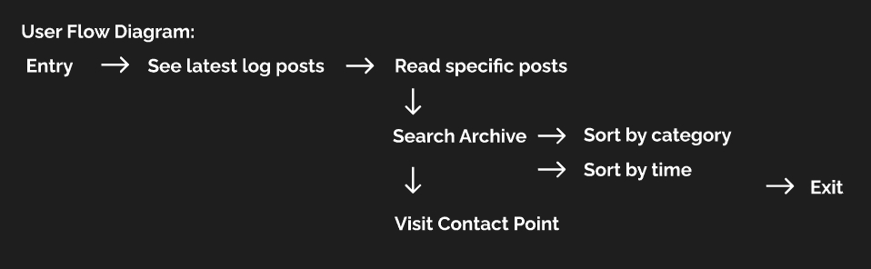
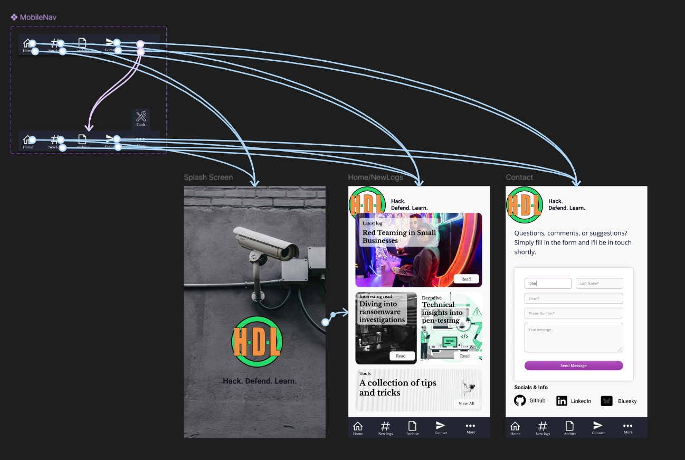
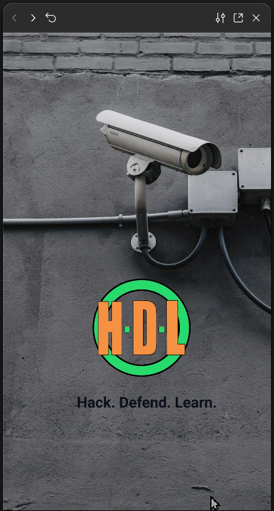
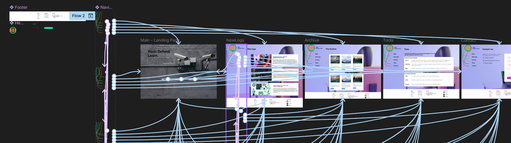

# Website Prototype for Web Visualizations Course  
**Course:** Web Visualizations TTC8410-3005
**University:** JAMK University of Applied Sciences  
**Due Date:** 17.11.2024

**Name:** Andreas Kjersheim
**Student ID:** AC4938

## Project Overview  
From previous courses I have tested creating preview sets and prototypes both by paper-cutouts, sketches, and using Figma. As I found the latter to be more rewarding previously, as I can test and add ideas as I go in a much easier manner, I decided to build my prototype using Figma.

One challenge I have had earlier as well was actually sharing the prototype. For that reason I have decided to add a link to the figma project, which has settings open to anyone with the link - however, from earlier tests one would need to sign in to figma nonetheless. To help with that inconvenience, I have also added a GIF animation of me testing the desktop version of the site - and the mobile version.

---

## Prototype

The entirety of this prototype is based on the SVG images from exercise 10.2. At this point, closing in on the deadline - I do regret going so hard on the SVG path. This is for that reason something I would assess as very early stage, and the navigation would most likely change drastically, but with the same idea. I do envision a more horizontal layout as well as better graphics on the navlines.svg file, to make it more appealing. Initially I had an idea with a very simplistic design, however, making it look simple while being clean and good looking was challenging. I did end up with a mobile design and a desktop idea, and spent most time testing different community assets and similar in Figma.

The idea for the website is to create a log, Due to the negative connotations related to blog. This is just an idea, and needs more work. The purpose of the website is to create visuals and present documentation on case-studies and topics I have been diving into lately - and in the future. Creating a web site where I can publish documentation in a visually pleasing manner, while also having an archive of "logs" which I can go back to. Who knows, maybe someone else would be interested as well? That would be the goal in a real setting, and it is an idea I have wanted to pursue for a long time. However, time limitations this fall might be an issue - but I think it is worth discussing the idea.

### User Flow Diagram

## Mobile Layout Overview

Due to limitations of size and our fingers/devices, and not least the rapid browsing from possibly readers - people dont spend many seconds on a site if they are sceptical - I wanted to create a curious landing/splash page with little information but incentives to move on. It still needs work on the transition from the landing/splash to the recent logs page - but that seemed to be easier to do with HTML rather than Figma. Having multiple hover and click events on a single object was a challenge. In some places I had to duplicate objects to maintain these two. 

From dragging the splash page up, the recent logs appear. Here I found some nice images, and added a brief explanation to give some options. For the mobile view, more article-cards would appear below, and in that case the bottom navigation menu would be a sticky menu. For the mobile view, the archives page is probably the most used to browse through once the user wants to continue exploring.

As for setup, I do wish to test tailwind more. Additionally, I did really enjoy SASS - so finding a way to see if that is worth combining is going to be my first step. Creating a framework for my site, then adding the content and the layouts from mobile first aspect and adhere to the best-practices we have learned through the course as best as I can - where it is suited.

### Link to Prototype

From the worksheet there are 2 pages. One for testing, another for mobile- and desktop views.

[https://www.figma.com/design/yosu8vghpzWvF7wlvKXeu8/WebVizProject](https://www.figma.com/design/yosu8vghpzWvF7wlvKXeu8/WebVizProject)

### Screenshot of the mobile figma workframes

### Direct Link to Mobile Preview Prototype

### Demonstration Animation/GIF

## Desktop Layout Overview

The main idea I explored in the desktop version was the navigation. The idea was to have originally a very basic white page with only text and figures+images. Using a navigation menu top left and then having an svg with movable lines/vectorgraphics that would react to user actions on the menu has been something I have wanted to try for a while. The end result was subpar, and I felt I had to color the page up with background images and similar. 

Initially I have always created layouts - then content. I had the idea this time over to create actual content for the page first, and then focus on presenting this content as well as I could. However, due to time constraints that ended up as a poor attempt, although I did have an interesting time using figma as a tool to realize the animations and layouts before starting the development process. 

### Screenshot of the desktop figma workframes

### Direct Link to Desktop Preview Prototype

### Demonstration Animation/GIF

