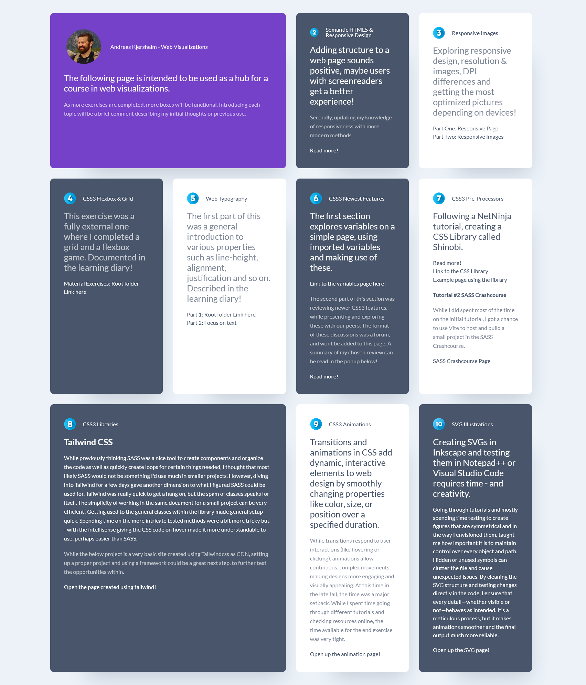

# Web Visualization

Root-index: Landing page

|Exercise # | Description                       | x for completed       |
| ---       | ---                               | ---                   |
|1          | Course introduction               | [x]                   |
|2          | Semantic HTML5 & Responsive Design| [x]                   |
|3          | Responsive Images                 | [x]                   |
|4          | CSS3 Flexbox & Grid               | [x]                   |
|5          | Web Typography                    | [x]                   |
|6          | CSS3 Newest Features              | [x]                   |
|7          | CSS Pre-Processors                | [x]                   |
|8          | CSS Libraries                     | [x]                   |
|9          | CSS Animations                    | [x]                   |
|10         | SVG Illustrations                 | [x]                   |

